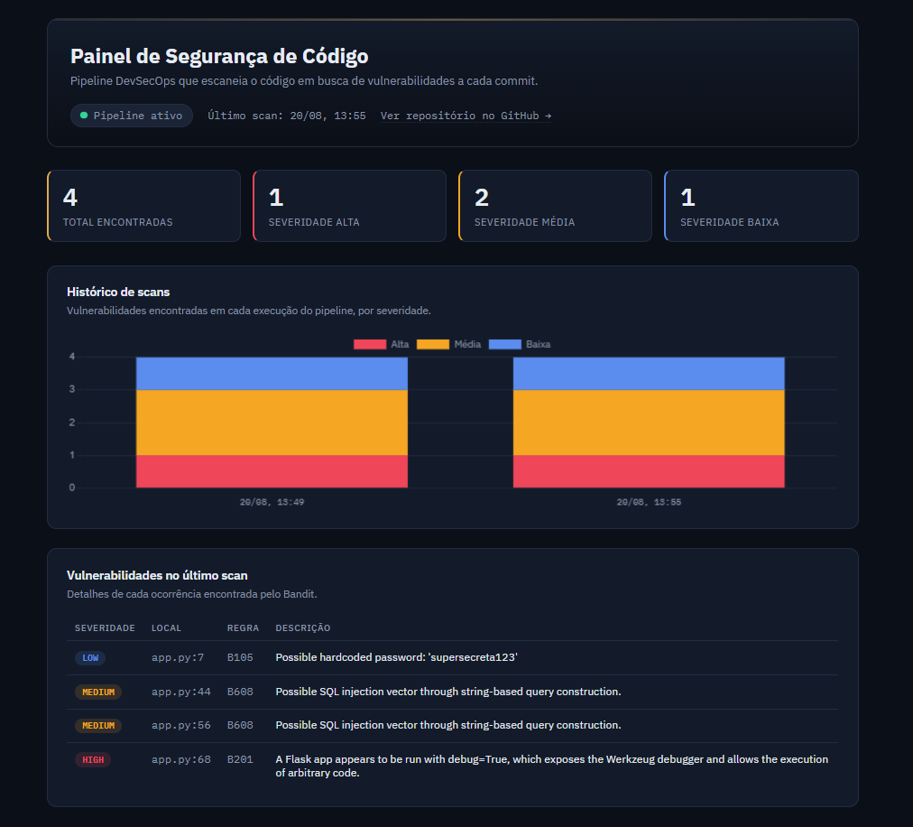

# 🔒 Painel de Segurança de Código

Pipeline de DevSecOps que escaneia automaticamente uma aplicação em busca de
vulnerabilidades a cada commit, guarda o histórico dos resultados e exibe
tudo num dashboard visual — sem precisar rodar nada manualmente.


**🔗 Dashboard ao vivo:** https://gustavohub-ctrl.github.io/ProjetoVulnerabilidade/



## O problema

Times pequenos costumam revisar segurança "de vez em quando", manualmente,
quando alguém lembra. Esse projeto resolve isso automatizando a checagem:
toda vez que um código novo é enviado, ele já é escaneado sozinho, e o
resultado fica visível num painel — sem depender de ninguém rodar nada.

## Como funciona

```
git push
   │
   ▼
GitHub Actions dispara o pipeline
   │
   ▼
Bandit escaneia o código (SAST) em busca de vulnerabilidades
   │
   ▼
Resultado é salvo em scans/ (histórico versionado no próprio repositório)
   │
   ▼
Dashboard (GitHub Pages) lê os dados direto do GitHub e exibe em tempo real
```

## Stack

| Camada              | Tecnologia                          |
|---------------------|--------------------------------------|
| Aplicação de exemplo| Python + Flask                       |
| Containerização     | Docker / Docker Compose              |
| Scanner de segurança| Bandit (SAST)                        |
| CI/CD               | GitHub Actions                       |
| Dashboard           | HTML, CSS, JavaScript + Chart.js     |
| Hospedagem          | GitHub Pages                         |

## Sobre a aplicação de exemplo

O `app.py` é uma API simples de cadastro de usuários, criada **de propósito**
com vulnerabilidades comuns (SQL Injection, segredo fixo no código, modo
debug ativo) para servir de alvo real para o scanner. A ideia não é a API
em si — é demonstrar o pipeline de segurança funcionando de ponta a ponta.

## Rodando localmente

```bash
docker compose up --build
```

A API sobe em `http://localhost:5000`.

## O que esse projeto demonstra

- Configuração de pipeline de CI/CD do zero (GitHub Actions)
- Uso de ferramenta de SAST (Static Application Security Testing)
- Containerização de aplicações com Docker
- Consumo de dados direto de APIs (GitHub API) num front-end sem back-end
- Versionamento de histórico de dados usando o próprio Git

---

Projeto pessoal desenvolvido por [Gustavo](https://github.com/GustavoHub-ctrl)
como parte do portfólio de estudos em Análise e Desenvolvimento de Sistemas.
